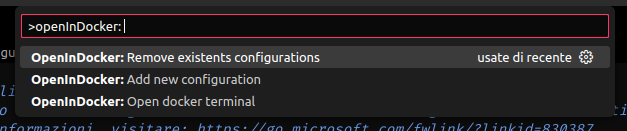
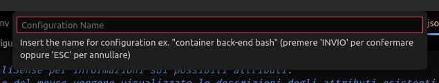
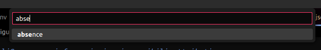

# Open In Docker

[english](README.md)

Questa estensione aggiunge un pulsante nella status bar per aprire più rapidamente un terminale nei container docker del progetto con la shell desiderata.
Gestisce anche configurazioni multiple (anche sullo stesso container).


## Features

### Comandi:
 - `>OpenInDocker: Remove existents configurations`: Rimuove una o più configurazioni a scelta
 - `>OpenInDocker: Add new configuration`: Aggiunge o sovrascrive una configurazione
 - `>OpenInDocker: Open docker terminal`: Apre il terminale in una configurazione a scelta (se ne esiste solo una verrà aperta direttamente)



### Aggiungere una nuova connessione
Per aggiungere una nuova connessione ci sono due metodi:
 - Cliccare sull'icona nella status bar (valido solo per la prima configurazione), **nota bene**: al termine della configurazione verrà aperto il terminale
 - Cliccare `F1` o `CTRL` + `SHIFT` + `P` e digitare il comando `OpenInDocker: Add new configuration` e seguire la configurazione guidata
 - Aggiungere nel file [launch.json](.vscode/launch.json) la configurazione manualmente, seguendo l'esempio:
   ```JSON
    {
        ...,
        "openInDocker": {
            "CONFIGURATION_NAME": {
                "terminalName": "TERMINAL_NAME_IN_VSCODE",
                "shell": "SHELL_NAME", // bash || zsh || sh
                "container": "CONTAINER_NAME"
            }
        }
    }
   ```

Seguendo la procedura guidata vi verranno chiesti:

**Configuration Name**: Nome della configurazione che verrà mostrata in fase di scelta della configurazione da usare/eliminare


**Terminal Name**: nome del terminale in vscode


**Shell**: Shell da usare nel terminale del container


**Container**: Container in cui aprire il terminale
> **Nota Bene**: È necessario che docker sia installato e aperto correttamente e che il container sia già stato creato



Per aggiungere due o più configurazioni è necessario eseguire il comando o modificare manualmente il file launch.json

### Aprire il terminale nel container
Per aprire il terminale del container potete cliccare sull'icona nella barra di stato oppure usare il comando `OpenInDocker: Open docker terminal`

In entrambi i casi avrete tre possibili scenari:
 1. Prima configurazione e apertura terminal (si verifica se non esistono configurazioni)
 1. Apertura diretta del terminale (si verifica se esiste una sola configurazione)
 1. Scelta della configurazione e successiva apertura (si verifica se esiste più di una configurazione)

### Rimozione configurazioni esistenti
Per rimuovere una o più configurazioni bisognerà eseguire il comando `OpenInDocker: Remove existents configurations` e selezionare le configurazioni da rimuovere


oppure editare manualmente il file [launch.json](.vscode/launch.json) del vostro progetto

## Requirements

Questa estensione richiede:
 - **docker** correttamente installato e configurato (è necessario poter eseguire il comando `docker ps` per la lista dei container)
 - **container** container già presenti al momento della configurazione

## Info sull'autore
Programmatore back-end classe '94. Sviluppo su sistemi linux e sono una persona sintetica

 - Nome: Urselli Cosimo
 - Email: urselli.workmail@gmail.com
 - Data nascita: 1994-01-12
 - Linguaggi di programmazione: C, PHP, JS, Golang, Python, SQL, BASH
 - Bevande preferite: tè, birra a malto rosso, vino rosso
 - Cibi preferiti: burrito, pizza, limoni