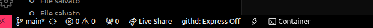
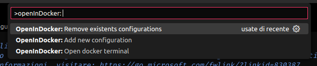
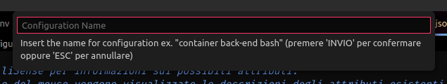
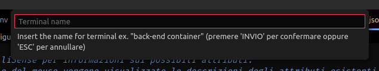
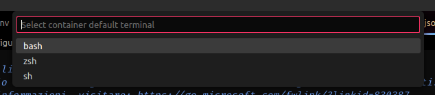
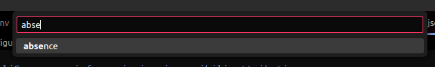
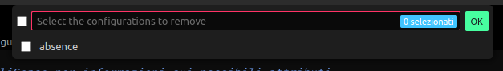

# Open In Docker

[italiano](README-IT.md)

This extension adds a button in the status bar to more quickly open a terminal in the project's Docker containers with the desired shell.
It also manages multiple configurations (even on the same container).


## Features

### Commands:
 - `>OpenInDocker: Remove existents configurations`: Removes one or more configurations of your choice
 - `>OpenInDocker: Add new configuration`: Adds or overwrites a configuration
 - `>OpenInDocker: Open docker terminal`: Opens the terminal in a configuration of your choice (if only one exists it will be opened directly)



### Add a new connection
To add a new connection there are 3 methods:
 - Click on the icon in the status bar (valid only for the first configuration), **note well**: at the end of the configuration the terminal will open
 - Click `F1` or `CTRL` + `SHIFT` + `P` and type the command `OpenInDocker: Add new configuration` and follow the configuration wizard
 - Add the configuration manually to the [launch.json](.vscode/launch.json) file, following the example:

   ```JSON
    {
        ...,
        "openInDocker": {
            "CONFIGURATION_NAME": {
                "terminalName": "TERMINAL_NAME_IN_VSCODE",
                "shell": "SHELL_NAME", // bash || zsh || sh
                "container": "CONTAINER_NAME"
            }
        }
    }
   ```

Following the guided procedure you will be asked:

**Configuration Name**: Name of the configuration that will be shown when choosing the configuration to use/delete


**Terminal Name**: Terminal name in vscode


**Shell**: Shell to use in the container terminal


**Container**: Container in which to open the terminal
> **Please Note**: Docker must be installed and opened correctly and the container must have already been created



To add two or more configurations you need to run the command or manually edit the launch.json file

### Open the terminal in the container
To open the container terminal you can click on the icon in the status bar or use the `OpenInDocker: Open docker terminal` command

In both cases you will have three possible scenarios:
 1. First configuration and terminal opening (occurs if no configurations exist)
 1. Direct opening of the terminal (occurs if there is only one configuration)
 1. Choice of configuration and subsequent opening (checks if there is more than one configuration)

### Removal of existing configurations
To remove one or more configurations you will need to run the `OpenInDocker: Remove existents configurations` command and select the configurations to remove



or manually edit the [launch.json](.vscode/launch.json) file of your project

## Requirements

This extension requires:
 - **docker** correctly installed and configured (you need to be able to run the `docker ps` command for the container list)
 - **containers** containers already present at the time of configuration

## Info about the author
Back-end programmer born in '94. I develop on Linux systems and I am a synthetic person
 - Name: Urselli Cosimo
 - Email: urselli.workmail@gmail.com
 - Date of birth: 1994-01-12
 - Programming languages: C, PHP, JS, Golang, Python, SQL, BASH
 - Favorite drinks: tea, red malt beer, red wine
 - Favorite foods: burritos, pizza, lemons